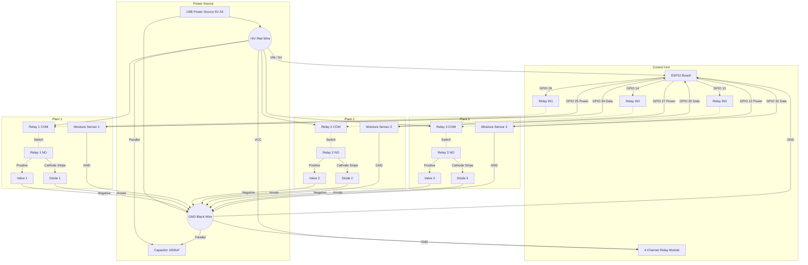

# ESP-WROOM-32 Wiring Diagram

This diagram illustrates the complete wiring for the 3-plant irrigation system, including power distribution, relay connections, flyback diode protection, and sensor connections.

