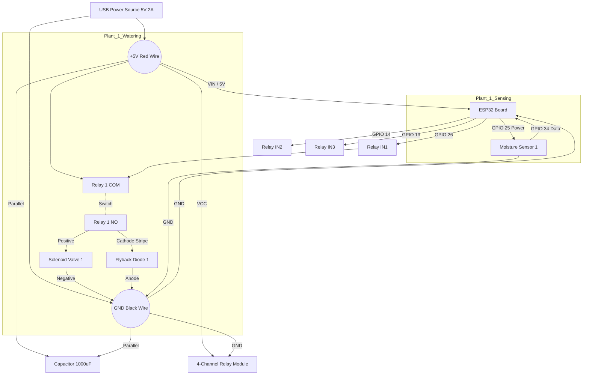

```mermaid
graph TD
    %% Power Supply
    USB[USB Power Source 5V 2A]
    USB_VCC((+5V Red Wire))
    USB_GND((GND Black Wire))

    USB --> USB_VCC
    USB --> USB_GND

    %% Capacitor Protection
    CAP[Capacitor 1000uF]
    USB_VCC -- Parallel --> CAP
    USB_GND -- Parallel --> CAP

    %% ESP32 Connections
    ESP[ESP32 Board]
    USB_VCC -->|VIN / 5V| ESP
    USB_GND -->|GND| ESP

    %% Relay Module
    RELAY[4-Channel Relay Module]
    USB_VCC -->|VCC| RELAY
    USB_GND -->|GND| RELAY
    ESP -->|GPIO 26| RELAY_IN1[Relay IN1]
    ESP -->|GPIO 14| RELAY_IN2[Relay IN2]
    ESP -->|GPIO 13| RELAY_IN3[Relay IN3]

    %% Plant 1 Circuit
    subgraph Plant_1_Watering
        R1_COM[Relay 1 COM]
        R1_NO[Relay 1 NO]
        VALVE1[Solenoid Valve 1]
        DIODE1[Flyback Diode 1]
        
        USB_VCC --> R1_COM
        R1_COM -. Switch .- R1_NO
        R1_NO -->|Positive| VALVE1
        R1_NO -->|Cathode Stripe| DIODE1
        
        VALVE1 -->|Negative| USB_GND
        DIODE1 -->|Anode| USB_GND
    end

    %% Plant 1 Sensor
    subgraph Plant_1_Sensing
        SENS1[Moisture Sensor 1]
        ESP -->|GPIO 25 Power| SENS1
        SENS1 -->|GPIO 34 Data| ESP
        SENS1 -->|GND| USB_GND
    end

    %% Connections
    RELAY_IN1 --> R1_COM
```